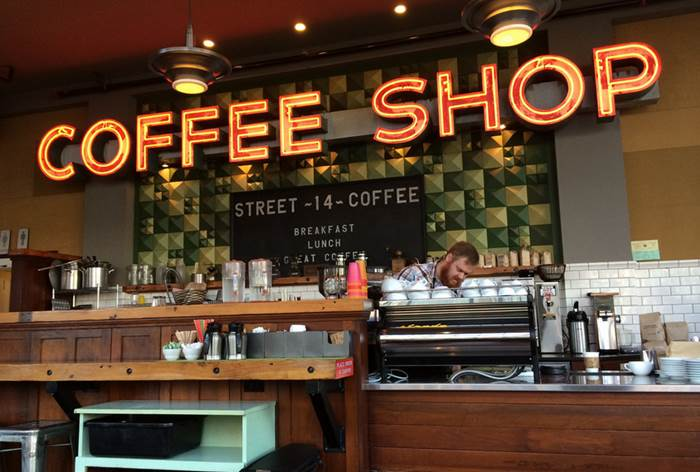
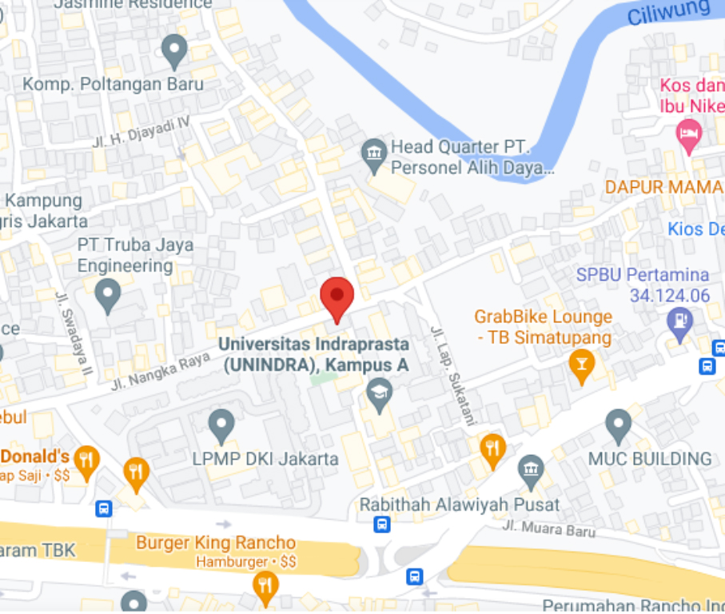

<!DOCTYPE html>
<html>
<title>Caffe Kita</title>
<meta charset="UTF-8">
<meta name="viewport" content="width=device-width, initial-scale=1">
<link rel="stylesheet" href="https://www.w3schools.com/w3css/4/w3.css">
<link rel="stylesheet" href="https://badoystudio.com/cloudme.fonts.googleapis.com/css?family=Inconsolata">
<link href="https://cdn.jsdelivr.net/npm/bootstrap@5.1.3/dist/css/bootstrap.min.css" rel="stylesheet" integrity="sha384-1BmE4kWBq78iYhFldvKuhfTAU6auU8tT94WrHftjDbrCEXSU1oBoqyl2QvZ6jIW3" crossorigin="anonymous">

<body>

<!-- Links (sit on top) -->

<a href="#" class="w3-button w3-block w3-black">HOME</a>

<a href="#about" class="w3-button w3-block w3-black">ABOUT</a>

<a href="#menu" class="w3-button w3-block w3-black">MENU</a>

<a href="#where" class="w3-button w3-block w3-black">WHERE</a>

<!-- Header with image -->
<header class="bgimg w3-display-container w3-grayscale-min" id="home">

Buka dari 06.00am-22.00pm

Cafe Kita

Jl.Nangka Pasar Rebo,Jakarta Timur

</header>

<!-- Add a background color and large text to the whole page -->

<!-- About Container -->

<h5 class="w3-center w3-padding-64">ABOUT CAFE KITA</h5>

Caffe Kita Didirikan pada 9 Desember 2021, Caffe ini didirikan dengan konsep Scandinavian,serta nuansa yang tenang dan minimalis. Cafe Kita juga dilengkapi dengan berbagai fasilitas seperti Wifi, Live musik, dan ruangan yang terbagi menjadi dua bagian yaitu Outdoor dan Indoor,serta terdapat banyak spot foto yang menarik. Coffe kita juga mempunyai alat standart Coffe Shop dan menggunakan biji kopi berkualitas premium sehingga penikmat dapat merasakan kopi yang diinginkan.

Kami juga menyediakan berbagai macam Breakfast, Lunch, dan dessert. 

<i>"Kurus atau Gendut adalah pilihan tapi makanan enak adalah kebutuhan"</i>

-Unknown

<strong>Jam Buka/Tutup:</strong> Setap Hari dari 06.00am-22.00pm

<strong>Alamat:</strong> Jl.Nangka Pasar Rebo,Jakarta Timur.

<!-- Menu Container -->

<h5 class="w3-center w3-padding-48">MENU</h5>

<a href="javascript:void(0)" onclick="openMenu(event, 'Makanan');" id="myLink">

Makanan

</a>
<a href="javascript:void(0)" onclick="openMenu(event, 'Minuman');">

Minuman

</a>

<h5>Roti Bakar</h5>

Dengan Berbagai Macam Rasa,Coklat,Vanilla,Strawberry,Oreo
 

<h5>Breakfast</h5>

Daging ayam lembut yang di balut dengan tepung yang renyah
 

Egg muffin
 

Saussage muffin
 

Chiken wrap
 

Pancakes
 

Mashed potato
 

<h5>Dessert</h5>

Pudding :Chocolate, Strawberry, Mango
 

Apple Pie: Chocolate Pie, Strawberry Pie, Pineapple Pise
 

Ice cream :Vanilla, Chocolate, strawberry
 

Churros : Chocolate, tiramisu
 

<h5>Coffee</h5>

ice salted coffe
 

Machiatto/conpanna
 

Americano/ Long black
 

Cappucino/ Latte
 

Moccacino
 

Solo Expresso
 

Tiramisu Latte
 

<h5>Chocolato</h5>

Chocolate espresso with milk
 

<h5>Corretto</h5>

Whiskey and coffee
 

<h5>tea</h5>

Hot/Cold
 

<h5>Soda</h5>

Coca-Cola, Sprite, Fanta,dll

 

<!-- Contact/Area Container -->

<h5 class="w3-center w3-padding-48">Dimana Kalian Dapat menemukan Kami</h5>

Temukan Kami Diberbagai Cabang Outlet Kami.

FYI!Kami menawarkan katering layanan lengkap untuk acara apa pun, besar atau kecil. Kami memahami kebutuhan Anda dan kami akan menyediakan makanan untuk memenuhi kriteria terbesar dari semuanya, baik tampilan maupun rasanya.

<strong>Reserve</strong> Pesan meja untuk hari spesial,bisa hubungi kami

<form action="/action_page.php" target="_blank">

<input class="w3-input w3-padding-16 w3-border" type="text" placeholder="Name" required name="Name">

<input class="w3-input w3-padding-16 w3-border" type="number" placeholder="How many people" required name="People">

<input class="w3-input w3-padding-16 w3-border" type="datetime-local" placeholder="Date and time" required name="date" value="2017-11-16T20:00">

<input class="w3-input w3-padding-16 w3-border" type="text" placeholder="Message \ Special requirements" required name="Message">

<button class="w3-button w3-black" type="submit">Kirim Pesan</button>

</form>

<!-- End page content -->

<!-- Footer -->
<footer class="w3-center w3-light-grey w3-padding-48 w3-large">

@Caffe_kita <!--<a href="https://www.w3schools.com/w3css/default.asp" title="W3.CSS" target="_blank" class="w3-hover-text-green">w3.css</a>-->

</footer>

</body>
</html>
